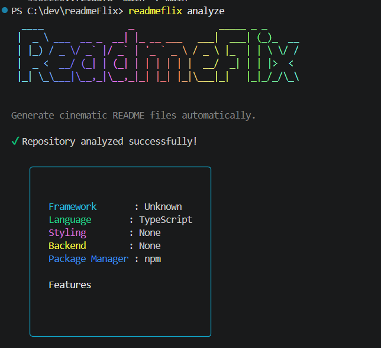
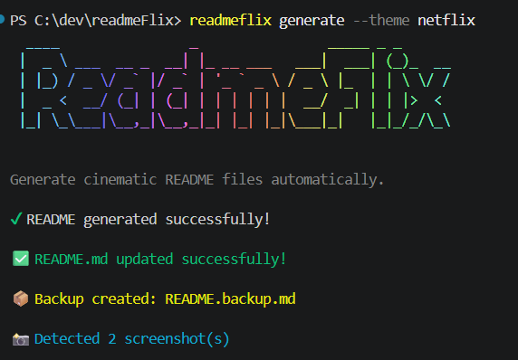
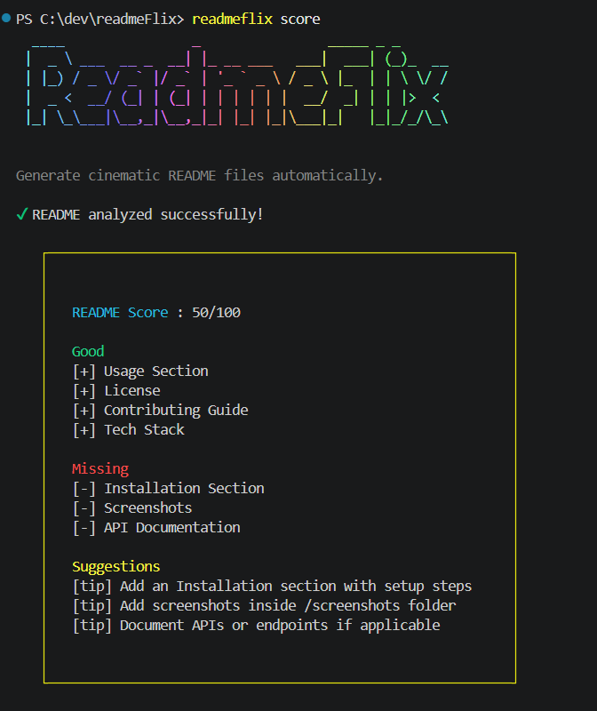

# 🚀 readmeflix

 

## 📖 Overview

Generate cinematic and intelligent README files automatically.

---

## 🛠 Tech Stack

- Unknown
- TypeScript

---

## 📦 Installation

```bash
npm install
```

---

## ▶️ Run Locally

```bash
npm run dev
```

---

## 📜 Scripts

- `build` → tsc
- `dev` → ts-node src/index.ts

---


## 🤝 Contributing

Contributions are welcome!


### ⭐ Generated with ReadmeFlix

## 📸 Preview






